# DevOps Assignment — Immverse.AI

A production-ready Node.js application with a fully automated CI/CD pipeline using Jenkins, Docker, and AWS EC2.

---

## Live

| Service | URL |
|---|---|
| Application | https://assignment.charchha.com |
| Health Check | https://assignment.charchha.com/health |
| Metrics | https://assignment.charchha.com/metrics |
| Jenkins | https://jenkins.charchha.com |

---

## Overview

Every `git push` to `main` triggers the full pipeline automatically via GitHub webhook.

- **Application:** Node.js 18 + Express with Prometheus metrics
- **CI/CD:** Jenkins declarative pipeline (9 stages)
- **Registry:** GitHub Container Registry (`ghcr.io/<your-github-username>/devops-assignment`)
- **Deployment:** AWS EC2 via SSH (zero-downtime container swap)
- **Reverse Proxy:** Nginx + Cloudflare (SSL termination)
- **Auto-Rollback:** On failure, reverts to previous build's image

---

## Architecture

```
Developer
    │
    │  git push
    ▼
GitHub (<your-github-username>/ImmverseAI-Assignment)
    │
    │  Webhook → https://jenkins.charchha.com/github-webhook/
    ▼
Jenkins EC2  (jenkins.charchha.com)
    │
    ├── 1. Checkout
    ├── 2. Install Dependencies  (npm ci)
    ├── 3. Run Tests             (Jest + coverage)
    ├── 4. Build Docker Image    (multi-stage)
    ├── 5. Tag Image             (:BUILD_NUMBER + :latest)
    ├── 6. Push to GHCR          (ghcr.io/<your-github-username>/devops-assignment)
    ├── 7. Deploy on EC2         (SSH → stop → pull → run)
    ├── 8. Verify Deployment     (curl /health)
    └── 9. Cleanup               (remove local images)
              │
              ▼
App EC2  (assignment.charchha.com)
    │
    ├── Nginx (port 80) → Docker container (port 3000)
    ▼
Cloudflare → HTTPS → Users
```

---

## Project Structure

```
devops-assignment/
├── app.js
├── package.json
├── package-lock.json
├── Dockerfile
├── Jenkinsfile
├── .gitignore
├── .env.example
├── Images/
├── monitoring/
│   ├── prometheus.yml
│   ├── docker-compose.yml
│   └── grafana-dashboard.json
└── tests/
    └── app.test.js
```

---

## Application Endpoints

| Endpoint | Response |
|---|---|
| `GET /` | `Hello from DevOps Assignment` |
| `GET /health` | `{"status":"healthy"}` |
| `GET /metrics` | Prometheus text metrics |

---

## Local Setup

```bash
git clone https://github.com/<your-github-username>/ImmverseAI-Assignment.git
cd ImmverseAI-Assignment

cp .env.example .env

npm install
npm test
npm start
```

---

## Docker

```bash
docker build -t ghcr.io/<your-github-username>/devops-assignment:latest .

docker run -d \
  --name devops-assignment-container \
  -p 3000:3000 \
  -e NODE_ENV=production \
  ghcr.io/<your-github-username>/devops-assignment:latest

curl http://localhost:3000/health
```

---

## Infrastructure Setup

### EC2 Instances

Two EC2 instances are required:

| Instance | Purpose | Domain |
|---|---|---|
| EC2 #1 | Jenkins CI/CD server | `jenkins.charchha.com` |
| EC2 #2 | Application server | `assignment.charchha.com` |

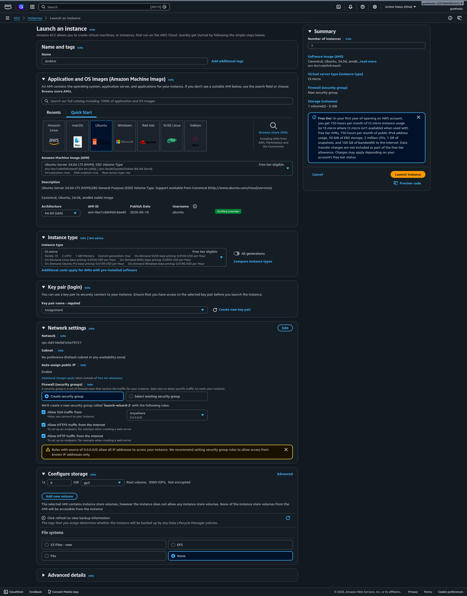

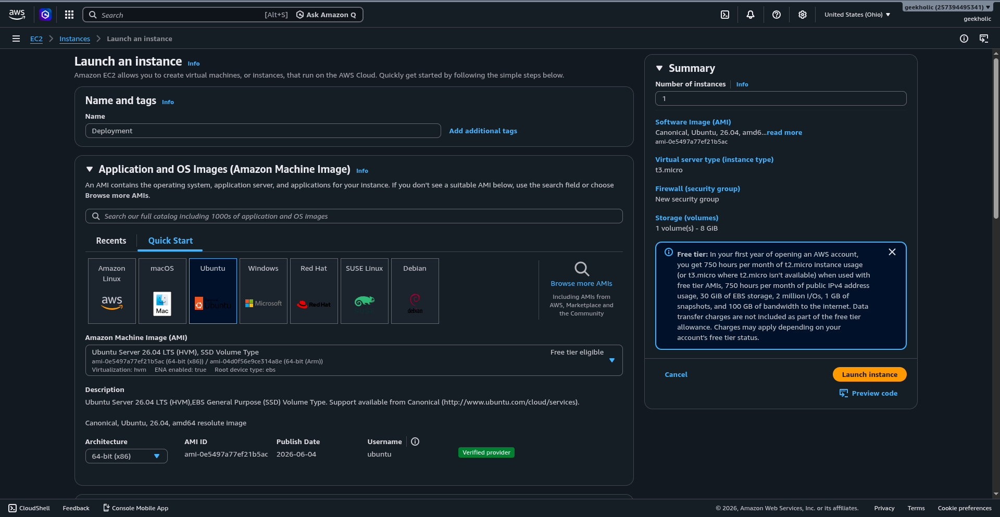

**Security Group — EC2 #1 (Jenkins):**

| Port | Source | Purpose |
|---|---|---|
| 22 | Your IP | SSH access |
| 80 | 0.0.0.0/0 | Nginx (Cloudflare proxy) |
| 443 | 0.0.0.0/0 | HTTPS |
| 8080 | Your IP | Temporary — direct Jenkins access during initial setup only |

> **Security Note:** Port 8080 is only needed during the initial Jenkins setup before Nginx and the domain are configured. Once `jenkins.charchha.com` is working via Nginx, **remove the 8080 inbound rule** from the security group. Jenkins should only be accessible through the domain, never directly on port 8080.

**Security Group — EC2 #2 (App):**

| Port | Source | Purpose |
|---|---|---|
| 22 | Jenkins EC2 IP | SSH from Jenkins |
| 80 | 0.0.0.0/0 | Nginx (Cloudflare proxy) |
| 443 | 0.0.0.0/0 | HTTPS |


---

### Installing Docker

> **Note:** Docker must be installed on **both** EC2 instances. The `usermod -aG docker jenkins` step is only required on the Jenkins server (EC2 #1).

**On both EC2 instances:**

```bash
sudo curl -fsSL https://get.docker.com | sudo sh

sudo usermod -aG docker $USER
newgrp docker
```

**On Jenkins EC2 only — add Jenkins user to Docker group:**

```bash
sudo usermod -aG docker jenkins
sudo systemctl restart jenkins
```

---

### Installing Jenkins (EC2 #1 only)

```bash
sudo apt update
sudo apt install -y openjdk-21-jdk

sudo mkdir -p /etc/apt/keyrings
wget -qO- https://pkg.jenkins.io/debian-stable/jenkins.io-2026.key | \
sudo tee /etc/apt/keyrings/jenkins-keyring.asc > /dev/null

echo "deb [signed-by=/etc/apt/keyrings/jenkins-keyring.asc] https://pkg.jenkins.io/debian-stable binary/" | \
sudo tee /etc/apt/sources.list.d/jenkins.list > /dev/null

sudo apt update
sudo apt install -y fontconfig jenkins

sudo systemctl enable --now jenkins

sudo cat /var/lib/jenkins/secrets/initialAdminPassword
```

Open `http://<EC2_1_IP>:8080` and complete the initial setup wizard.

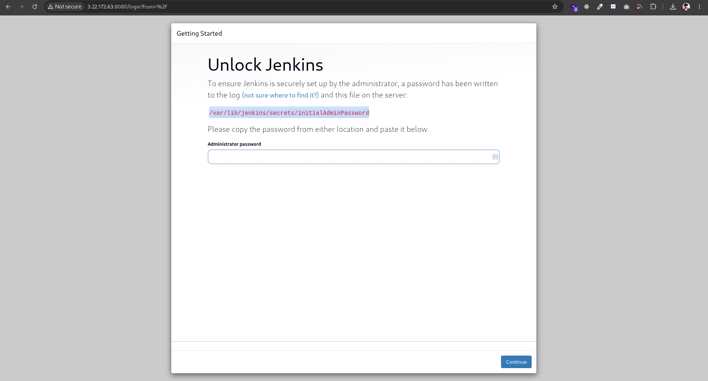

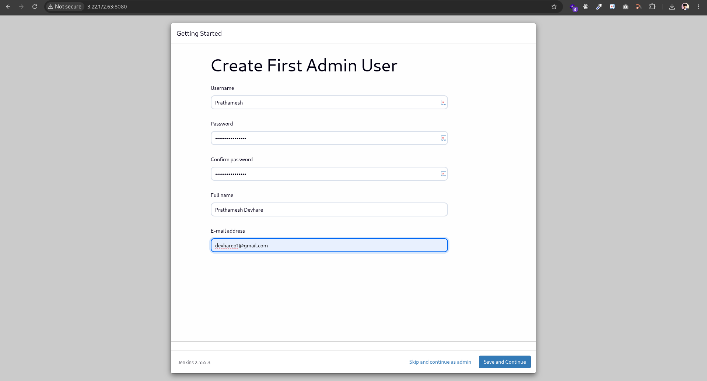

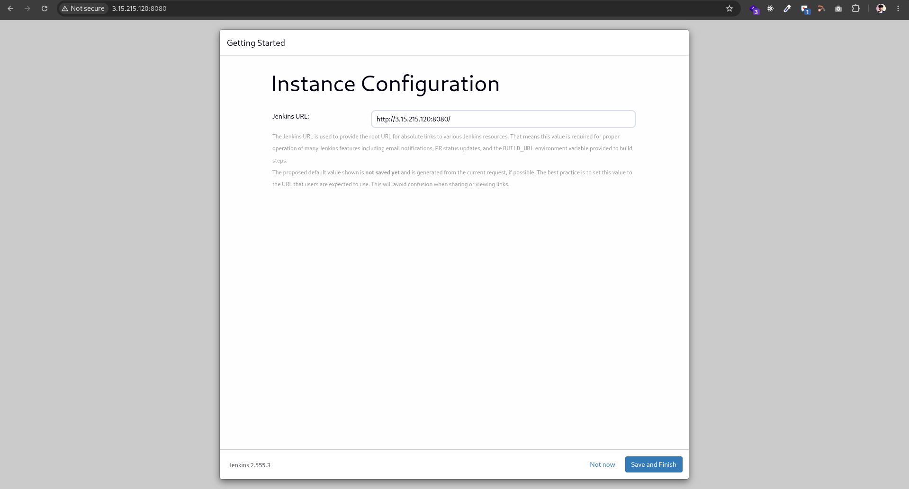

---

### Installing Nginx

**On both EC2 instances:**

```bash
sudo apt-get update && sudo apt-get install -y nginx
```

**EC2 #1 — Jenkins reverse proxy:**

```bash
sudo tee /etc/nginx/sites-available/jenkins.charchha.com > /dev/null <<'EOF'
server {
    listen 80;
    server_name jenkins.charchha.com;

    location / {
        proxy_pass         http://localhost:8080;
        proxy_http_version 1.1;
        proxy_set_header   Host              $host;
        proxy_set_header   X-Real-IP         $remote_addr;
        proxy_set_header   X-Forwarded-For   $proxy_add_x_forwarded_for;
        proxy_set_header   X-Forwarded-Proto https;
        proxy_read_timeout 90s;
    }
}
EOF

sudo ln -sf /etc/nginx/sites-available/jenkins.charchha.com /etc/nginx/sites-enabled/
sudo rm -f /etc/nginx/sites-enabled/default
sudo nginx -t && sudo systemctl enable nginx && sudo systemctl start nginx
```

**EC2 #2 — Application reverse proxy:**

```bash
sudo tee /etc/nginx/sites-available/assignment.charchha.com > /dev/null <<'EOF'
server {
    listen 80;
    server_name assignment.charchha.com;

    location / {
        proxy_pass         http://localhost:3000;
        proxy_http_version 1.1;
        proxy_set_header   Host              $host;
        proxy_set_header   X-Real-IP         $remote_addr;
        proxy_set_header   X-Forwarded-For   $proxy_add_x_forwarded_for;
        proxy_set_header   X-Forwarded-Proto https;
        proxy_set_header   Upgrade           $http_upgrade;
        proxy_set_header   Connection        'upgrade';
    }
}
EOF

sudo ln -sf /etc/nginx/sites-available/assignment.charchha.com /etc/nginx/sites-enabled/
sudo rm -f /etc/nginx/sites-enabled/default
sudo nginx -t && sudo systemctl enable nginx && sudo systemctl start nginx
```

**Block direct IP access on both servers:**

```bash
sudo tee /etc/nginx/sites-available/block-direct-ip > /dev/null <<'EOF'
server {
    listen 80 default_server;
    server_name _;
    return 444;
}
EOF

sudo ln -sf /etc/nginx/sites-available/block-direct-ip /etc/nginx/sites-enabled/block-direct-ip
sudo nginx -t && sudo systemctl reload nginx
```

---

### Cloudflare DNS

Add the following A records in Cloudflare with the **orange cloud (Proxied) enabled**:

| Type | Name | Value |
|---|---|---|
| A | `jenkins` | `<EC2_1_PUBLIC_IP>` |
| A | `assignment` | `<EC2_2_PUBLIC_IP>` |

Set **SSL/TLS → Overview → Flexible** (Cloudflare handles HTTPS; EC2s serve HTTP on port 80).

Enable **SSL/TLS → Edge Certificates → Always Use HTTPS**.

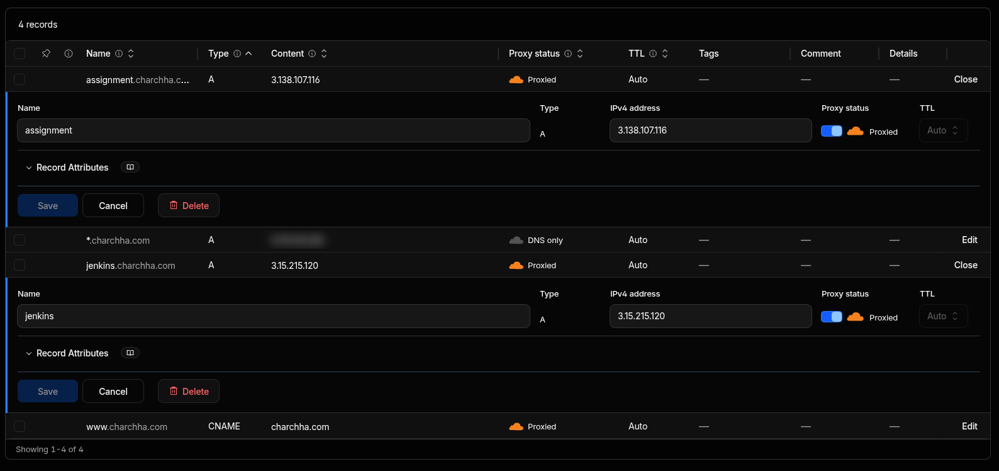

---

## Jenkins Configuration

### Required Plugins

Go to **Manage Jenkins → Plugins → Available** and install:

- SSH Agent
- Docker Pipeline
- Email Extension
- HTML Publisher
- NodeJS
- GitHub Integration


---

### Credentials

**Manage Jenkins → Credentials → Global → Add Credential**

| Credential ID | Kind | Details |
|---|---|---|
| `ghcr-creds` | Username with password | GitHub username + PAT (with `write:packages` scope) |
| `ssh-ec2` | SSH Username with private key | `ubuntu` + EC2 PEM key content |
| `gmail-smtp` | Username with password | Gmail address + App Password |

---

### Global Environment Variables

**Manage Jenkins → System → Global Properties → Environment Variables**

| Name | Example Value |
|---|---|
| `GHCR_USERNAME` | `<your-github-username>` |
| `IMAGE_NAME` | `devops-assignment` |
| `CONTAINER_NAME` | `devops-assignment-container` |
| `APP_PORT` | `3000` |
| `HOST_PORT` | `3000` |
| `DEVOPS_EC2_HOST` | `<EC2_2_PUBLIC_IP>` |
| `DEVOPS_EC2_USER` | `ubuntu` |
| `DEVOPS_EMAIL_RECIPIENTS` | `your@email.com` |

---

### Gmail SMTP

**Manage Jenkins → System → Extended E-mail Notification**

| Field | Value |
|---|---|
| SMTP Server | `smtp.gmail.com` |
| Port | `465` (SSL) or `587` (TLS/STARTTLS) |
| Credentials | `gmail-smtp` |
| Use SSL | Enabled for port 465 |
| Use TLS | Enabled for port 587 |

---

### Create Pipeline Job

1. **New Item → Pipeline → name: `ImmverseAI-Assignment`**
2. Build Triggers → **GitHub hook trigger for GITScm polling**
3. Pipeline → **Pipeline script from SCM**
4. SCM: Git → `https://github.com/<your-github-username>/ImmverseAI-Assignment`
5. Branch: `*/main` | Script Path: `Jenkinsfile`

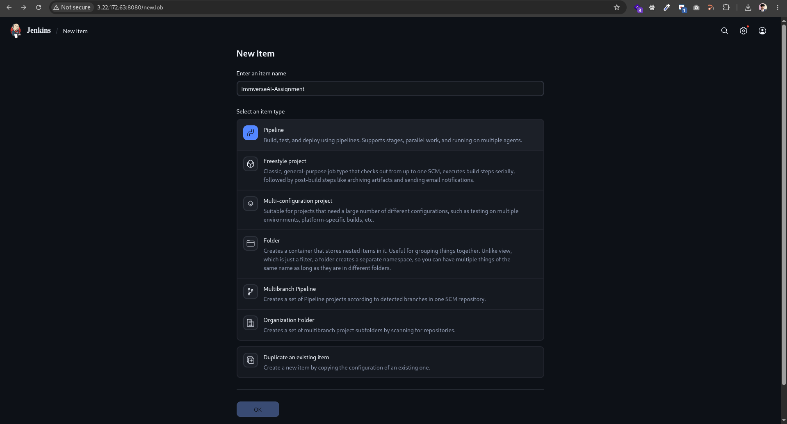

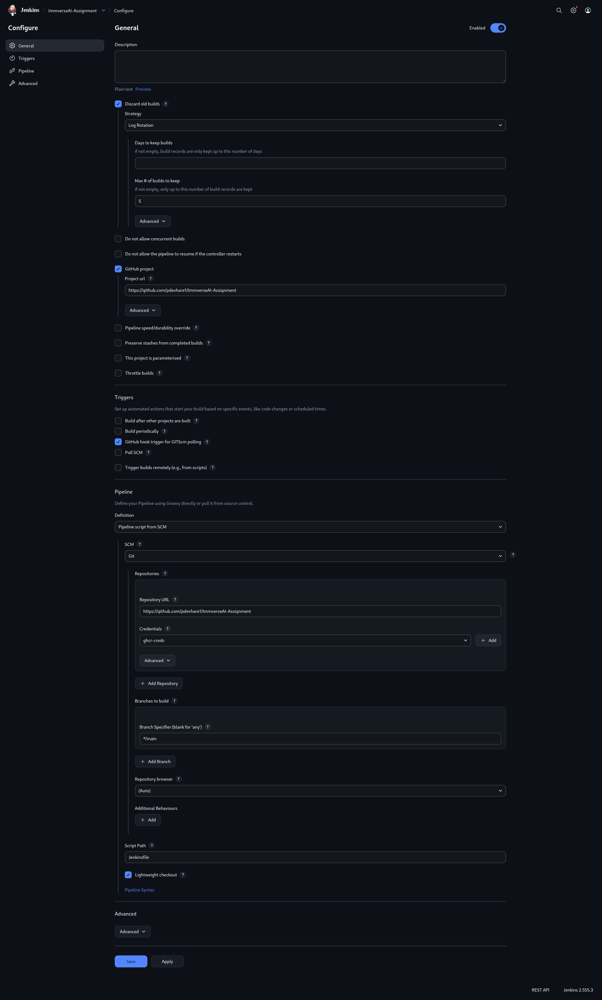

---

### GitHub Webhook

**GitHub → `<your-github-username>/ImmverseAI-Assignment` → Settings → Webhooks → Add webhook**

| Field | Value |
|---|---|
| Payload URL | `https://jenkins.charchha.com/github-webhook/` |
| Content type | `application/json` |
| Events | Just the push event |

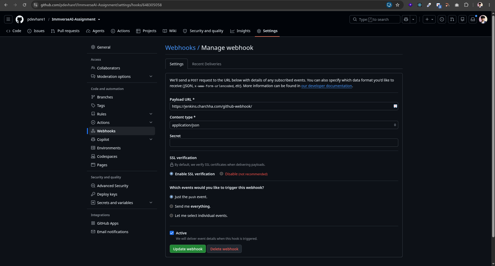

---

## Pipeline Stages

| # | Stage | What it does |
|---|---|---|
| 1 | Checkout | Pulls latest code from GitHub |
| 2 | Install Dependencies | `npm ci` |
| 3 | Run Tests | `jest --coverage` (70% threshold) |
| 4 | Build Docker Image | Multi-stage build — tests run inside builder stage |
| 5 | Tag Image | Tags `:BUILD_NUMBER` and `:latest` |
| 6 | Push Docker Image | Pushes both tags to `ghcr.io` |
| 7 | Deploy on EC2 | SSH → stop old container → pull new image → run |
| 8 | Verify Deployment | SSH → `curl /health` confirms app is live |
| 9 | Cleanup | Removes local images from Jenkins agent |

On failure: auto-rollback to previous build image + email notification sent.


### Email Notifications

Jenkins sends an email automatically on every build result.

**Build Success:**

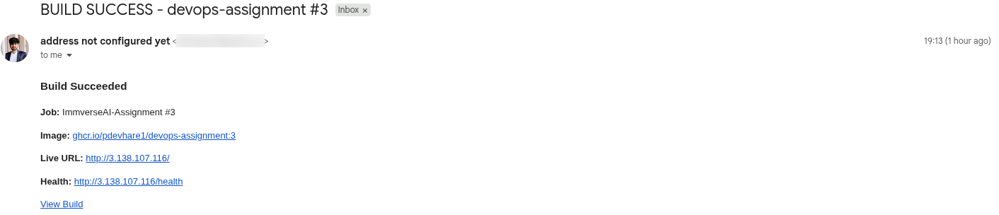

**Build Failed:**

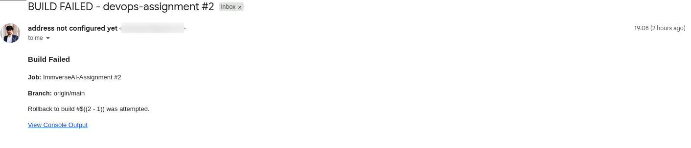

---

## Monitoring

The monitoring stack runs on the App EC2 alongside the application using Docker Compose. It includes:

- **Prometheus** — scrapes metrics from the app and cAdvisor
- **Grafana** — visualizes metrics with a pre-built dashboard
- **cAdvisor** — collects Docker container-level CPU, memory, and network metrics

---

### Setup on App EC2

```bash
mkdir ~/monitoring && cd ~/monitoring
```

**Create `prometheus.yml`:**

```bash
cat > prometheus.yml <<'EOF'
global:
  scrape_interval: 15s

scrape_configs:
  - job_name: 'devops-assignment'
    static_configs:
      - targets: ['host.docker.internal:3000']
    metrics_path: /metrics

  - job_name: 'cadvisor'
    static_configs:
      - targets: ['cadvisor:8080']
EOF
```

**Create `docker-compose.yml`:**

```bash
cat > docker-compose.yml <<'EOF'
services:
  prometheus:
    image: prom/prometheus:latest
    ports:
      - "9090:9090"
    volumes:
      - ./prometheus.yml:/etc/prometheus/prometheus.yml
    extra_hosts:
      - "host.docker.internal:host-gateway"
    restart: unless-stopped

  grafana:
    image: grafana/grafana:latest
    ports:
      - "3001:3000"
    environment:
      - GF_SECURITY_ADMIN_USER=admin
      - GF_SECURITY_ADMIN_PASSWORD=admin123
    volumes:
      - grafana-data:/var/lib/grafana
    restart: unless-stopped

  cadvisor:
    image: gcr.io/cadvisor/cadvisor:latest
    ports:
      - "8081:8080"
    volumes:
      - /:/rootfs:ro
      - /var/run:/var/run:ro
      - /sys:/sys:ro
      - /var/lib/docker/:/var/lib/docker:ro
    restart: unless-stopped

volumes:
  grafana-data:
EOF
```

**Start the stack:**

```bash
docker compose up -d
docker compose ps
```

---

### Configuring Grafana

Grafana runs on port `3001` and Prometheus is accessible internally within the Docker Compose network at `http://prometheus:9090` — no Nginx proxy is needed for either service.

1. Open Grafana at `http://<EC2_2_PUBLIC_IP>:3001` (ensure port 3001 is open in the App EC2 security group)
2. Login with `admin / admin123`
3. Go to **Connections → Data Sources → Add new data source → Prometheus**
4. Set URL to `http://prometheus:9090` → click **Save & Test**

---

### Importing the Dashboard

1. Go to **Dashboards → New → Import**
2. Upload `monitoring/grafana-dashboard.json` from this repository
3. Select the Prometheus data source → click **Import**

The dashboard includes 12 panels covering:

- Container Health (UP / UNHEALTHY)
- CPU Usage (Node.js process + container via cAdvisor)
- Memory Usage (RSS, Heap, container memory)
- HTTP Request Rate by route and status code
- HTTP Request Duration (P50 / P95 / P99)
- Node.js Event Loop Lag
- Container Network I/O

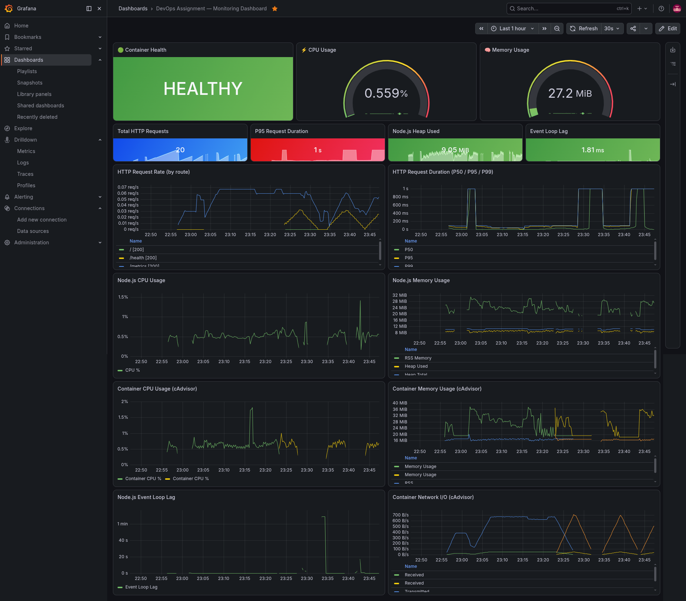

---

## Tech Stack

| Layer | Technology |
|---|---|
| Runtime | Node.js 18 |
| Framework | Express |
| Testing | Jest + Supertest |
| Containers | Docker (multi-stage) |
| CI/CD | Jenkins Declarative Pipeline |
| Registry | GitHub Container Registry (GHCR) |
| Deployment | AWS EC2 (Ubuntu 22.04) |
| Reverse Proxy | Nginx |
| SSL / CDN | Cloudflare |
| Metrics | Prometheus + prom-client |
| Dashboards | Grafana |
| Container Metrics | cAdvisor |

---

## Troubleshooting

**Container not starting**
```bash
docker logs devops-assignment-container --tail 50
```

**Nginx not proxying**
```bash
sudo nginx -t
sudo systemctl status nginx
curl http://localhost/health
```

**Jenkins SSH stage fails**
```bash
ssh -o StrictHostKeyChecking=no ubuntu@<EC2_APP_IP> 'docker ps'
```

**Image pull fails on EC2**
```bash
echo "<GHCR_PAT>" | docker login ghcr.io -u <your-github-username> --password-stdin
docker pull ghcr.io/<your-github-username>/devops-assignment:latest
```

**Health check fails after deploy**
```bash
curl https://assignment.charchha.com/health
docker ps | grep devops-assignment-container
```
